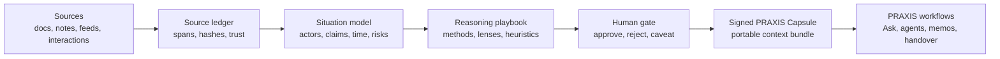
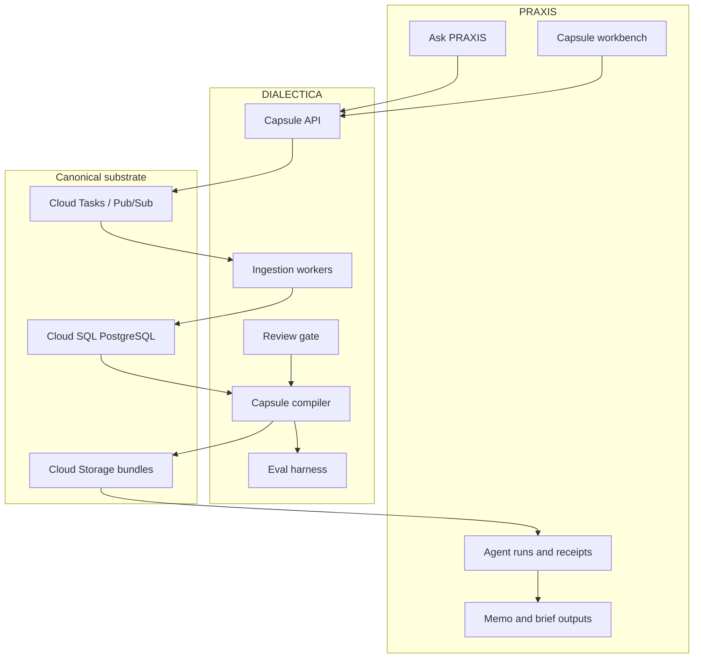
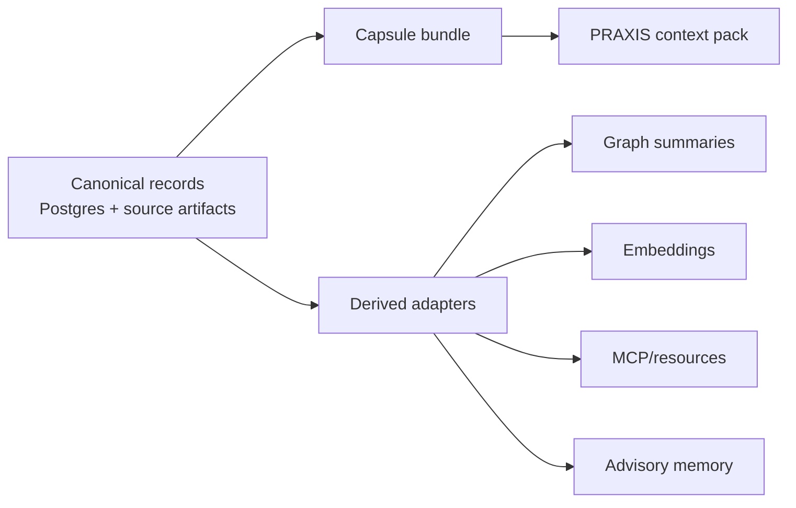

<p align="center">
  
</p>


DIALECTICA is the internal TACITUS capsule intelligence engine for PRAXIS.

Its job is to compile messy policy context into portable, source-grounded,
reviewable **PRAXIS Capsules** that PRAXIS agents can concatenate inside
analysis, research, drafting, scenario, and decision workflows.

The product thesis is:

> PRAXIS Augmented Generation with PRAXIS Capsules by TACITUS.

The technical thesis is:

> A capsule is a signed, portable, self-describing analytical context object: a
> model of a situation plus a model of how to think about it.

## Why This Exists

Generic LLM generation loses the things policy teams care about most: source
status, time, institutional context, contested facts, tacit expert reasoning,
review gates, and handover memory. DIALECTICA fixes that by compiling these
elements into a portable capsule that PRAXIS can inspect and use.



## What DIALECTICA Builds

DIALECTICA does not build another chatbot memory layer. It builds capsules that
carry the real context policy teams need:

- the user, team, institution, mandate, audience, and decision horizon;
- the situation, actors, constraints, incentives, claims, uncertainties, and
  live-world changes;
- source ledgers, citations, document spans, provenance, and trust status;
- temporal state: true now, stale, superseded, contested, predicted, or unknown;
- ontologies, semantic layers, entity graphs, causal links, and competing
  frames;
- expert reasoning devices, policy heuristics, philosophical lenses, analytic
  tradecraft, and review notes;
- output contracts for memos, briefings, scenarios, plans, model cards, and
  PRAXIS agent workflows;
- human review gates, audit receipts, and capsule version history.

## Relationship to PRAXIS

PRAXIS remains the visible cockpit. DIALECTICA is the engine behind it.



Public product language should say **PRAXIS Capsules**, **Capsules**, **Capsule
AI**, or **Capsule Library**. Use **DIALECTICA Engine** for internal
architecture and implementation docs.

## MVP Architecture

The first working version is contract-first and engine-less before it becomes
engine-rich. The capsule bundle format, provenance model, review ledger, and
PRAXIS integration contract must work before advanced graph/AI adapters become
required.

Core services:

- **Capsule API**: creates capsule jobs, returns capsule manifests, exposes
  bundle metadata, and serves PRAXIS integration endpoints.
- **Ingestion workers**: parse documents, normalize source spans, extract
  entities, detect temporal claims, and write provenance records.
- **Capsule compiler**: assembles capsule bundles from canonical records,
  review decisions, ontology slices, graph summaries, and retrieval packs.
- **Review gate**: records human approvals, rejections, expert notes, red-team
  findings, and promotion decisions.
- **Evaluation harness**: tests source fidelity, temporal accuracy, retrieval
  quality, reasoning transfer, and PRAXIS answer improvement.

MVP promise:

> Given a small policy source pack and a review decision, DIALECTICA can compile
> a valid PRAXIS Capsule bundle that PRAXIS can use to produce a more grounded,
> more temporally aware, more source-faithful policy answer than raw prompting.

Canonical stores:

- **Cloud SQL PostgreSQL** for capsule metadata, source ledger, entities,
  temporal facts, review states, job state, and pgvector-ready embeddings.
- **Cloud Storage** for immutable source artifacts and signed capsule bundles.
- **Firestore adapter** where PRAXIS needs capsule visibility in its current
  user-facing surfaces.
- Optional graph/semantic adapters only after the base contract is stable.

## Capsule Formal Model

At MVP scale, a capsule is:

```text
Capsule = Identity + Situation + Sources + Time + Ontology + Graph
        + Reasoning Devices + Retrieval Pack + Output Contracts
        + Review Ledger + Evaluation Report + Signature
```

The most important distinction is between **canonical records** and **derived
adapters**.



Graph, vector, MCP, and memory planes can make retrieval better, but they do not
replace the capsule bundle or PostgreSQL ledger in the MVP.

## Deployment Direction

Start on **Cloud Run**, not Kubernetes.

Cloud Run is the right MVP substrate because DIALECTICA needs containerized API
services, event-driven workers, jobs, Cloud SQL access, managed scaling, and low
operational overhead before it needs cluster-level control. The current Google
Cloud docs describe Cloud Run services as managed container execution, Cloud Run
worker pools for non-HTTP pull-based processing, and native integrations with
Cloud SQL, Firestore, Cloud Storage, and monitoring.

Recommended first deployment:

- Cloud Run service: `dialectica-api`
- Cloud Run service: `dialectica-task-handler`
- Cloud Run jobs: `capsule-backfill`, `capsule-eval`, `source-reindex`
- Cloud Tasks queues: durable ingestion, compile, review, and export work
- Pub/Sub topics: optional fanout for long-running ingestion and live updates
- Cloud SQL PostgreSQL: operational capsule store
- Cloud Storage: source artifacts and capsule bundles
- Secret Manager: API keys, model credentials, signing keys
- Artifact Registry: container images
- Cloud Build or GitHub Actions: build, test, scan, deploy

Use **GKE Autopilot later** if the engine proves it needs Kubernetes-native
scheduling, long-running clustered graph services, custom network policies,
operator-managed infrastructure, or hardware-specific workloads. Google Cloud
documents Cloud Run and GKE as portable container runtimes, which keeps this
choice reversible if the system outgrows Cloud Run.

Primary source anchors:

- Cloud Run overview:
  <https://docs.cloud.google.com/run/docs/overview/what-is-cloud-run>
- Cloud Run to Cloud SQL for PostgreSQL:
  <https://docs.cloud.google.com/sql/docs/postgres/connect-run>
- Cloud Tasks HTTP target tasks:
  <https://docs.cloud.google.com/tasks/docs/creating-http-target-tasks>
- GKE and Cloud Run comparison:
  <https://docs.cloud.google.com/kubernetes-engine/docs/concepts/gke-and-cloud-run>
- GKE Autopilot overview:
  <https://docs.cloud.google.com/kubernetes-engine/docs/concepts/autopilot-overview>

See [docs/DEPLOYMENT.md](docs/DEPLOYMENT.md) for the full deployment decision.

## Benchmark-Informed Position

The current AI memory and knowledge-graph ecosystem points to four useful
patterns:

| Pattern | What to learn | DIALECTICA stance |
| --- | --- | --- |
| Temporal context graphs | Time, provenance, and evolving facts matter for agents operating on changing facts. | Adopt temporal/provenance semantics, but keep Postgres and bundle export canonical. |
| Agent memory layers | Agents need durable user/session/project state. | Capture memory as reviewed capsule records, not uncontrolled chat memory. |
| GraphRAG pipelines | Graph structure improves synthesis over private corpora. | Use graph slices and evals, but avoid expensive batch graph dependency for MVP. |
| Agent orchestration runtimes | Long-running workflows need persistence, human gates, and traces. | PRAXIS owns visible agent runs; DIALECTICA supplies capsule context and receipts. |

See [docs/TECH_BENCHMARK.md](docs/TECH_BENCHMARK.md) for sources and lessons
from Graphiti/Zep, Cognee, Mem0, Khoj, Letta, Microsoft GraphRAG, LangGraph,
MCP, and the OpenAI Agents SDK.

## Repository Map

```text
assets/
  dialectica-mark.svg                    GitHub README mark
docs/
  DIALECTICA_v3_BUILD_INSTRUCTIONS.md   imported canonical build spec
  SOURCE_OF_TRUTH.md                    document priority and working rules
  MVP_DEFINITION.md                      first product slice and non-goals
  TECH_BENCHMARK.md                      research and ecosystem comparison
  CAPSULE_FORMAL_MODEL.md                formal capsule layers and invariants
  INTELLECTUAL_TOOLS.md                  policy reasoning devices and capture
  ARCHITECTURE.md                       system architecture and data flow
  API_CONTRACT.md                        API endpoints PRAXIS will consume
  CAPSULE_SPEC.md                       capsule bundle contract
  DATA_MODEL.md                         PostgreSQL-first record model
  DEPLOYMENT.md                         Cloud Run first deployment plan
  PRAXIS_INTEGRATION.md                 PRAXIS handoff and API contract
  IMPLEMENTATION_BLUEPRINT.md           ordered engineering plan
  LOCAL_DEVELOPMENT.md                  local dev and fixture workflow
  CI_CD.md                              continuous integration and release gates
  REPOSITORY_STRUCTURE.md               ownership map for repo directories
  AGENTIC_WORKFLOWS.md                  Codex agent swarm lanes and gates
  PRAXIS_REPO_ALIGNMENT.md              integration seams from PRAXIS repo
  RESEARCH_BACKLOG.md                   research tracks for future improvement
  AGENT_GUIDE.md                        build lanes for future agents
  BUILD_LEDGER.md                       decisions, tasks, and evidence trail
  DEPENDENCIES.md                       dependency candidates and constraints
  EVAL_PLAN.md                          quality gates and eval strategy
  OPERATIONS.md                         observability and runbooks
  ROADMAP.md                            staged build plan
  SECURITY_AND_PRIVACY.md               trust, privacy, and threat posture
  decisions/                            architecture decision records
crates/                                 Rust crates will live here
services/                               deployable services will live here
infrastructure/                         Terraform/OpenTofu and deployment files
fixtures/                               test capsules, source packs, eval data
tests/                                  integration and contract tests
```

## Build Principles

1. Contract first: capsule schema, provenance, review, and export are the first
   product.
2. Source-cited always: every derived claim must point back to source material
   or expert review.
3. Temporal by default: policy context changes; capsules must carry dates,
   freshness, supersession, and uncertainty.
4. Postgres first: keep the MVP operational store simple, inspectable, and
   migratable.
5. Graph as adapter: graph engines enrich the capsule, but they are not the only
   copy of truth.
6. Human-gated promotion: expert review is a first-class capability, not a
   future admin screen.
7. PRAXIS-compatible output: every capsule should be useful to PRAXIS agentic
   workflows without special pleading.

## Current Status

This repository is at **Phase 0: source-of-truth initialization**.

The next implementation step is to create the Rust workspace, define the
capsule bundle schema, add fixtures, and build contract tests before adding
ingestion or model-powered extraction.

Start here:

1. Read [docs/SOURCE_OF_TRUTH.md](docs/SOURCE_OF_TRUTH.md).
2. Read [docs/DIALECTICA_v3_BUILD_INSTRUCTIONS.md](docs/DIALECTICA_v3_BUILD_INSTRUCTIONS.md).
3. Read [docs/MVP_DEFINITION.md](docs/MVP_DEFINITION.md).
4. Read [docs/CAPSULE_SPEC.md](docs/CAPSULE_SPEC.md).
5. Read [docs/API_CONTRACT.md](docs/API_CONTRACT.md).
6. Read [docs/ARCHITECTURE.md](docs/ARCHITECTURE.md).
7. Read [docs/IMPLEMENTATION_BLUEPRINT.md](docs/IMPLEMENTATION_BLUEPRINT.md).
8. Read [docs/INTELLECTUAL_TOOLS.md](docs/INTELLECTUAL_TOOLS.md).

## First Build Commands

These are planned commands. They become mandatory once the Rust workspace lands.

```powershell
cargo fmt --all -- --check
cargo clippy --workspace --all-targets -- -D warnings
cargo test --workspace
cargo run -p dialectica-cli -- validate fixtures/golden-policy-capsule
```

The first local runtime should not require cloud credentials. Cloud credentials
arrive only when staging deployment begins.

## License

This repository is proprietary TACITUS source unless TACITUS later chooses an
open-source license. See [LICENSE](LICENSE).
