<p align="center">
  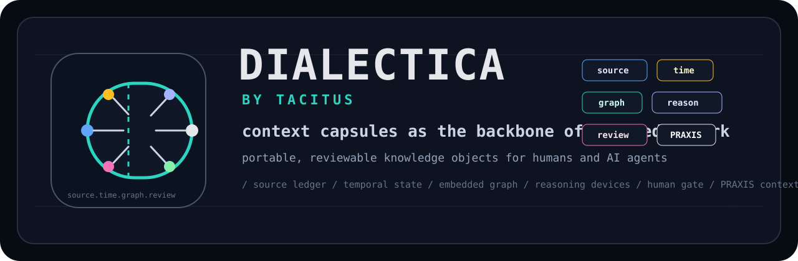
</p>


DIALECTICA is the TACITUS context-capsule engine for PRAXIS.

Its job is to build the context-capsule backbone for PRAXIS: durable,
source-grounded knowledge objects that humans and AI agents can inspect, share,
compose, and use interchangeably across policy, research, analysis, drafting,
scenario, and decision workflows.

The product thesis is:

> PRAXIS Augmented Generation with PRAXIS Capsules by TACITUS.

The technical thesis is:

> A PRAXIS Capsule is a signed, portable `.capsule` object with two faces:
> substrate, the knowledge to reason over, and guidance, the expert reasoning
> to reason with.

Current truth:

- **Works now**: Rust contract validation, canonical v3 Situation Capsule
  fixture validation with required embedded Ladybug projection, legacy
  migration fixture validation, source-pack validation, fixture-mode extraction
  proposal validation, review-trigger routing, reviewer-decision validation,
  promotion normalization, deterministic fixture-mode v3 package compilation,
  deterministic local document-folder capsule building, `.capsule` archive
  writing, PRAXIS context-pack export, PRAXIS local import receipts,
  review-queue and promotion-summary artifacts, JSONL user/assistant
  discussion capture as local source material, deterministic MVP eval checks,
  Codex MCP stdio tools/resources/prompts, Axum fixture API routes, build-plan
  printing, schema export, and CLI
  `doctor`/`validate`/`inspect`/`ontology-plan`/`ladybug-*`/`source-pack-check`/
  `proposal-check`/`build-plan`/`review-check`/`promote-check`/`schema-export`.
  `welcome`/`build-docs`/`build-fixture`/`archive`/`context-pack`/
  `praxis-pack`/`mcp-config`/`eval`.
- **Not built yet**: editable review-decision workflow, PDF/OCR/scanned-image
  and web ingestion, richer conversation adapters, live model provider calls,
  PostgreSQL migrations, durable build jobs, task handler, cloud artifact
  storage, auth, deployment wiring, and PRAXIS frontend integration.
- **Next build**: editable review decisions first, so a human-edited reject or
  approval can re-run promotion and recompilation before cloud persistence or
  live provider work starts.

Start with [docs/CODING_LEDGER.md](docs/CODING_LEDGER.md) and
[docs/NEXT_CODE_BUILD_PLAN.md](docs/NEXT_CODE_BUILD_PLAN.md). Use
[docs/README.md](docs/README.md) for the complete documentation map.

## Why This Matters

Generic LLMs are good at producing plausible text from loose context.
DIALECTICA is built for the harder problem: preserving the context that makes a
policy answer usable after the chat window closes.

- **For policy teams**: a capsule keeps sources, dates, caveats, reasoning
  method, reviewed language, and output scope together.
- **For engineers**: a capsule is a typed, signed, testable contract with
  provenance, `graph.jsonld`, review gates, generated agent views, and
  PRAXIS-facing APIs.
- **For investors and operators**: capsules create a defensible knowledge layer
  for PRAXIS, where expert-reviewed context, methods, and language can become a
  reusable library rather than one-off prompt work.

The ambition is not just better retrieval. It is a backbone for knowledge work:
human-gated knowledge, tacit expert reasoning, and reviewed language that can be
handed to agentic workflows without losing provenance or judgment.

## About

DIALECTICA exists because serious knowledge work needs a shared object between
people and AI agents. Policy teams do not only need answers. They need the
source trail, temporal status, institutional context, contested claims, expert
reasoning, reviewed language, review caveats, and output rules that make an
answer usable.

The capsule is that object.

```text
                   DIALECTICA by TACITUS

     docs + feeds + notes + interactions + expert judgement
             |
             v
  +------------------------------------------------------+
  | PRAXIS Capsule                                      |
  |                                                      |
  | source ledger -> temporal ledger -> semantic plan    |
  |       |                |                 |           |
  |       v                v                 v           |
  | source spans ---- embedded graph ---- reasoning      |
  |       |                |          language profile   |
  |       |                |                 |           |
  |       +---------- human review gate -----+           |
  |                         |                            |
  |                  output contracts                    |
  +------------------------------------------------------+
             |
             v
      PRAXIS agents, analysts, reviewers, memos, briefs
```

The larger vision is that capsules become infrastructure for knowledge work: a
policy analyst, expert reviewer, AI agent, and institution can point to the
same capsule and see the same evidence, graph, reasoning layer, caveats, rights,
and usage constraints.

<p align="center">
  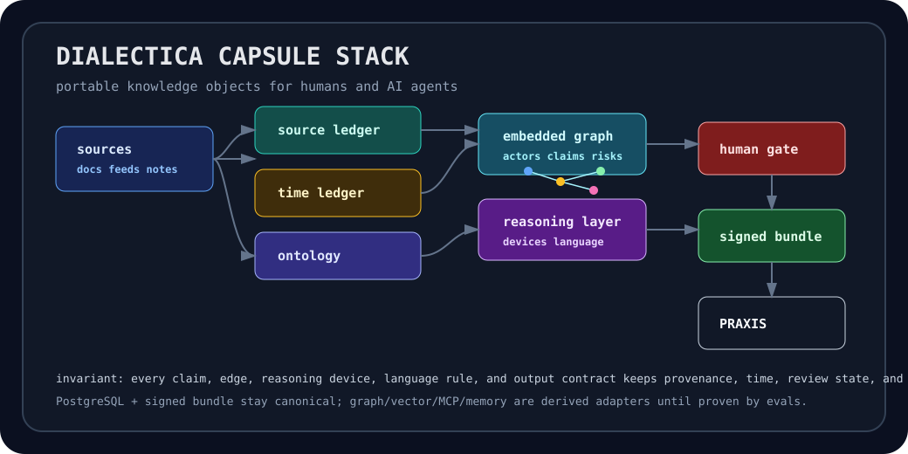
</p>

See [docs/ABOUT_DIALECTICA.md](docs/ABOUT_DIALECTICA.md) for the product
definition.

<p align="center">
  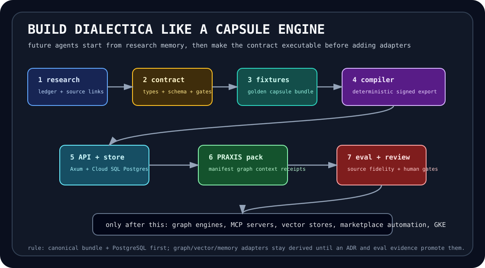
</p>

<p align="center">
  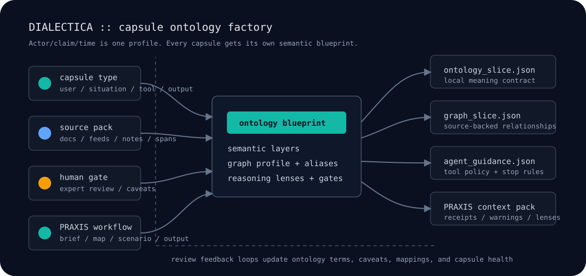
</p>

## TACITUS System Map

```text
TACITUS
  |
  +-- PRAXIS       visible cockpit for policy work and agentic workflows
  |
  +-- DIALECTICA   context-capsule engine that builds PRAXIS Capsules
  |
  +-- AGON         future perception and signal subsystem
  |
  +-- KAIROS       future temporal/situational timing subsystem
```

PRAXIS is what users operate. DIALECTICA is the engine that makes PRAXIS
answers more inspectable, source-faithful, temporally aware, and expert-shaped.
The repo therefore optimizes for a backend that can build, improve, validate,
sign, store, combine, and serve capsules.

## What DIALECTICA Builds

DIALECTICA does not build another chatbot memory layer. It builds capsules that
carry the durable knowledge structure that policy teams need:

- one of four PRAXIS-importable capsule classes: User, Situation, Tool, or
  Output;
- the user, organization, mandate, audience, and decision horizon when building
  User Capsules;
- the situation, source base, conflict state, stakeholder structure, caveats,
  domain meaning, and decision context when building Situation Capsules;
- the intellectual tools, philosophical lenses, analytical methods, and failure
  modes that guide reasoning when building Tool Capsules;
- the artifact lineage, citations, reuse rules, caveats, and handoff context
  when building Output Capsules;
- actors, constraints, incentives, claims, uncertainties, and live-world
  changes when the capsule type requires them;
- source ledgers, citations, document spans, provenance, and trust status;
- temporal state: true now, stale, superseded, contested, predicted, or unknown;
- ontologies, semantic layers, entity graphs, causal links, and competing
  frames;
- expert reasoning devices, policy heuristics, philosophical lenses, analytic
  tradecraft, and review notes;
- reviewed language profiles: approved terms, audience register, voice,
  forbidden framings, translation notes, and diplomatic constraints;
- output contracts for memos, briefings, scenarios, plans, model cards, and
  PRAXIS agent workflows;
- human review gates, audit receipts, and capsule version history.

The point is interchangeability: a human analyst should be able to open the
capsule, understand the same knowledge structure that an AI agent receives, and
decide whether it is fit for a specific workflow.

## Relationship to PRAXIS

PRAXIS remains the visible cockpit. DIALECTICA supplies the capsule backbone.

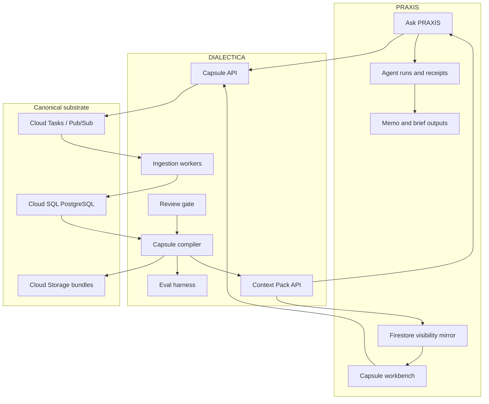

Public product language should say **PRAXIS Capsules**, **Capsules**, **Capsule
AI**, or **Capsule Library**. Use **DIALECTICA Engine** for internal
architecture and implementation docs.

## Build Architecture

The first working version is contract-first and engine-specific where the
product needs it. The capsule bundle format, provenance model, review ledger,
`graph.jsonld`, required embedded Ladybug projection, semantic layer, and
PRAXIS integration contract must work before broader graph/AI adapters are
added.

Core services:

- **Capsule API**: creates capsule jobs, returns capsule manifests, exposes
  bundle metadata, and serves PRAXIS integration endpoints.
- **Ingestion workers**: parse documents, normalize source spans, extract
  entities, detect temporal claims, and write provenance records.
- **Extraction proposal layer**: Rust crate for source packs, model receipts,
  proposal records, build plans, and review-trigger routing. The current
  implementation is fixture-mode only; live provider calls come later.
- **Capsule compiler**: assembles v3 `.capsule` packages from canonical
  records, review decisions, ontology layers, a connected `graph.jsonld`,
  runtime rules, and generated agent views.
- **Review gate**: records human approvals, rejections, expert notes, red-team
  findings, and promotion decisions.
- **Evaluation harness**: tests source fidelity, temporal accuracy, retrieval
  quality, reasoning transfer, and PRAXIS answer improvement.

Current coding scaffold:

```text
Cargo workspace
  crates/dialectica-capsule       contract types and validation
  crates/dialectica-builder       local document-folder capsule builder
  crates/dialectica-extractor     source-pack/proposal/review/promotion contracts
  crates/dialectica-compiler      deterministic bundle assembly
  crates/dialectica-graph         Ladybug projection planning/build/check/query
  crates/dialectica-store         PostgreSQL repositories and migrations
  crates/dialectica-eval          quality and outcome checks
  crates/dialectica-cli           local validation and fixture commands
  services/dialectica-api         PRAXIS-facing API
  services/dialectica-mcp         Codex MCP stdio capsule builder
  services/dialectica-task-handler Cloud Tasks entrypoint
  tests/dialectica-contract-tests workspace contract tests
```

Start coding from [docs/CODING_LEDGER.md](docs/CODING_LEDGER.md). Read
[docs/CODE_AUDIT_2026_06_08.md](docs/CODE_AUDIT_2026_06_08.md),
[docs/MISSING_WORK_AUDIT_2026_06_08.md](docs/MISSING_WORK_AUDIT_2026_06_08.md),
[docs/LLM_CONTEXT_EXTRACTION_ARCHITECTURE.md](docs/LLM_CONTEXT_EXTRACTION_ARCHITECTURE.md),
and [docs/SCAFFOLD_AUDIT.md](docs/SCAFFOLD_AUDIT.md) before claiming that any
slice is functional. The next implementation sequence is in
[docs/NEXT_CODE_BUILD_PLAN.md](docs/NEXT_CODE_BUILD_PLAN.md), and the active
gap-control standard is in
[docs/IMPROVEMENT_GUIDELINES.md](docs/IMPROVEMENT_GUIDELINES.md).

Current executable surface:

```powershell
cargo install --path crates/dialectica-cli
dialectica welcome
cargo run -p dialectica-cli -- welcome
cargo run -p dialectica-cli -- build-docs --type situation --input .\docs --out $env:TEMP\dialectica-doc-capsule --title "Local Situation Capsule" --workflow decision_brief
cargo run -p dialectica-cli -- inspect $env:TEMP\dialectica-doc-capsule\package
cargo run -p dialectica-cli -- mcp-config
cargo run -p dialectica-cli -- doctor
cargo run -p dialectica-cli -- validate fixtures/canonical-capsules/conflict-situation-capsule
cargo run -p dialectica-cli -- inspect fixtures/canonical-capsules/conflict-situation-capsule
cargo run -p dialectica-cli -- ladybug-check fixtures/canonical-capsules/conflict-situation-capsule
cargo run -p dialectica-cli --features ladybug -- ladybug-query fixtures/canonical-capsules/conflict-situation-capsule "MATCH (n:CapsuleNode) RETURN count(n) AS node_count;"
cargo run -p dialectica-cli -- validate fixtures/golden-policy-capsule/expected-bundle
cargo run -p dialectica-cli -- inspect fixtures/golden-policy-capsule/expected-bundle
cargo run -p dialectica-cli -- ontology-plan fixtures/golden-policy-capsule/expected-bundle
cargo run -p dialectica-cli -- source-pack-check fixtures/golden-policy-capsule/source-pack/source_pack.json
cargo run -p dialectica-cli -- proposal-check fixtures/golden-policy-capsule/build_request.json fixtures/golden-policy-capsule/source-pack/source_pack.json fixtures/golden-policy-capsule/proposals
cargo run -p dialectica-cli -- build-plan fixtures/golden-policy-capsule/build_request.json fixtures/golden-policy-capsule/source-pack/source_pack.json fixtures/golden-policy-capsule/proposals
cargo run -p dialectica-cli -- review-check fixtures/golden-policy-capsule/build_request.json fixtures/golden-policy-capsule/source-pack/source_pack.json fixtures/golden-policy-capsule/proposals fixtures/golden-policy-capsule/review-decisions
cargo run -p dialectica-cli -- promote-check fixtures/golden-policy-capsule/build_request.json fixtures/golden-policy-capsule/source-pack/source_pack.json fixtures/golden-policy-capsule/proposals fixtures/golden-policy-capsule/review-decisions
cargo run -p dialectica-cli -- schema-export schemas/capsule-3.0
```

This proves the repository is not only product copy. It already has typed Rust
capsule contracts, v3 package validation, schema export, a canonical v3
Situation Capsule fixture with a real embedded `graph/ladybug/capsule.lbug`, a
legacy migration fixture, source-pack/proposal/review/promotion validation, a
capsule-specific ontology planner, and Ladybug projection check/query commands.
It does not yet call live models, write compiled capsules from promoted records,
or serve PRAXIS; that boundary is tracked in the code audit and build ledger.

LLM extraction architecture:

```text
documents + user/assistant discussion + expert notes
  -> source spans and hashes
  -> capsule-specific ontology blueprint
  -> LLM proposal records
  -> Rust validation and cross-checks
  -> human review gates
  -> deterministic v3 .capsule
  -> PRAXIS context pack
```

The rule is strict: LLMs propose context, graphs, reasoning devices, and
language rules; Rust validation and human review promote them.

Initial runtime promise:

> Given a small policy source pack and a review decision, DIALECTICA can compile
> a valid PRAXIS `.capsule` that PRAXIS can use to produce a more grounded,
> more temporally aware, more source-faithful policy answer than raw prompting.

Canonical stores:

- **Cloud SQL PostgreSQL** for capsule metadata, source ledger, entities,
  temporal facts, review states, job state, and pgvector-ready embeddings.
- **Cloud Storage** for immutable source artifacts and signed capsule bundles.
- **Firestore adapter** where PRAXIS needs capsule visibility in its current
  user-facing surfaces.
- **Embedded Ladybug projection** inside every promoted capsule so PRAXIS and
  agents can query the capsule graph offline.
- Optional semantic/vector/MCP/memory adapters only after the base contract is
  stable.

## Capsule Formal Model

At initial runtime scale, a capsule is:

```text
Capsule = Manifest + Evidence + Claims + Episodes + graph.jsonld
        + Reasoning Guidance + Review + Runtime Contract
        + agent_context.md + operations.md + Signature
```

The PRAXIS-facing capsule classes are fixed:

```text
User + Situation + Tool + Output
```

The ontology and graph inside each capsule are capsule-specific. A conflict
Situation Capsule may need source proof, stakeholder power, domain semantics,
scenario causality, and temporal caveats. A User Capsule may need role,
authority, privacy, preference, and language semantics. A Tool Capsule may need
method steps, required inputs, philosophical distinctions, failure modes, and
review caveats. An Output Capsule may need artifact sections, claim lineage,
source receipts, reuse rules, and reviewer caveats. DIALECTICA keeps shared
graph classes for interoperability, but every capsule develops the semantic
layers that fit its matter and intended PRAXIS workflows.

<p align="center">
  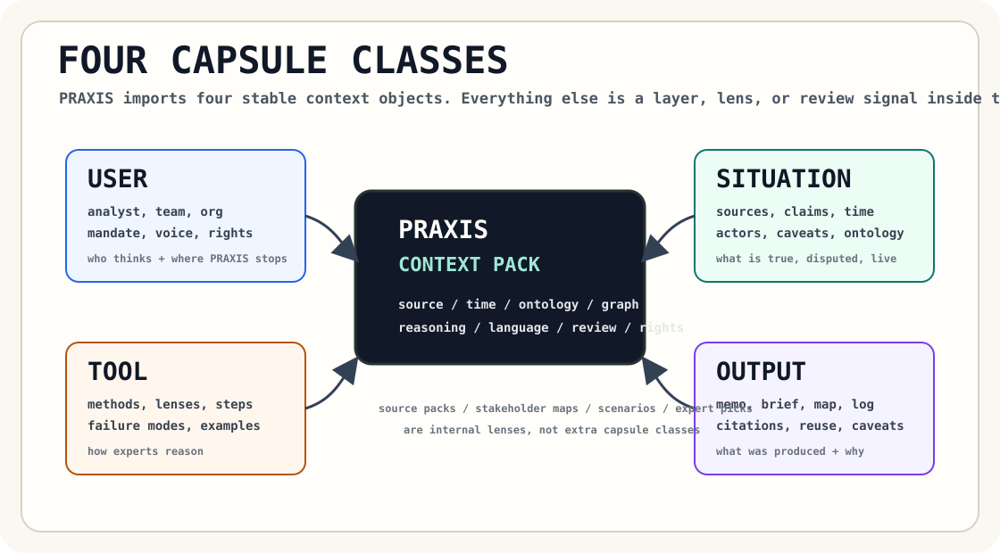
</p>

<p align="center">
  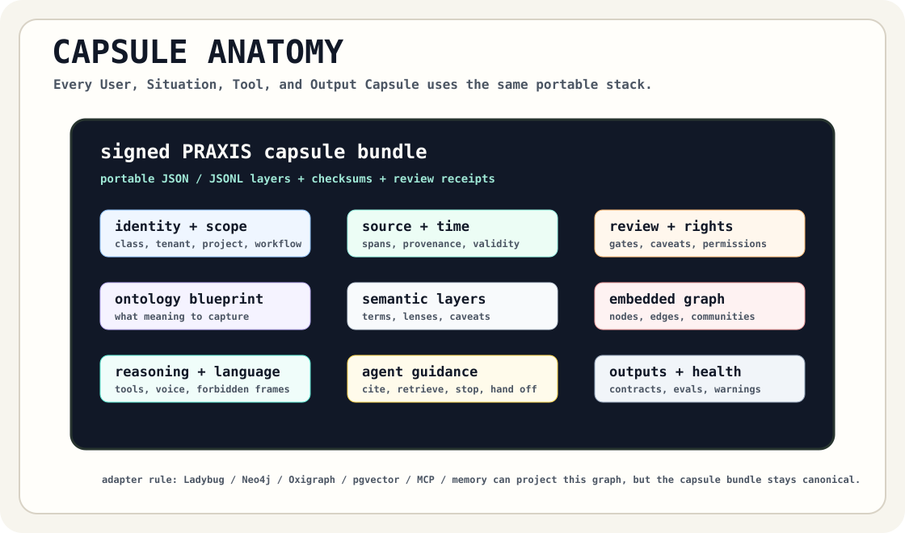
</p>

```text
capsule type + workflow + source pack
        |
        v
ontology blueprint
        |
        +--> local terms, frames, aliases, caveats
        +--> graph profile and PRAXIS lens
        +--> reasoning questions and review gates
        |
        v
portable capsule context
```

The most important distinction is between **canonical records** and **derived
adapters**.

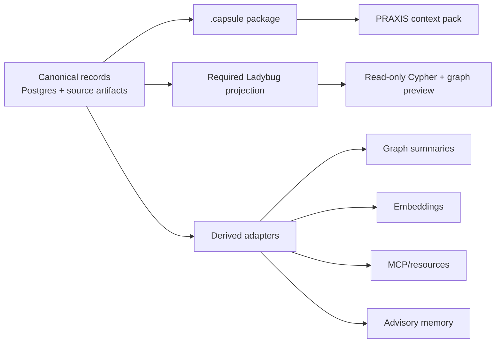

Ladybug makes the capsule graph immediately queryable, but it does not replace
`graph.jsonld`, the `.capsule` package, source spans, review receipts, or the
PostgreSQL operational ledger. Other graph, vector, MCP, and memory planes are
derived adapters.

## Capsule Types

PRAXIS should not receive one generic context object, and it should not receive
an expanding list of overlapping capsule products. DIALECTICA builds exactly
four top-level capsule classes with clear compatibility rules:

| Capsule | What it packages | Example use |
| --- | --- | --- |
| User Capsule | user, analyst, team, organization, mandate, voice, permissions, privacy | personalized Ask PRAXIS and team handover |
| Situation Capsule | sources, time, actors, claims, caveats, domain semantics, stakeholder and scenario lenses | live policy analysis, conflict map, decision brief |
| Tool Capsule | intellectual tools, expert methods, philosophical lenses, method steps, failure modes | stakeholder analysis, conflict mapping, ACH, red team |
| Output Capsule | produced artifact plus reasoning trail | memo reuse and handover |

Source packs, domain ontologies, stakeholder maps, scenario branches, expert
picks, and graph modules are internal layers, lenses, or marketplace metadata
inside those four classes. They are not top-level capsule types.

Example composition:

```text
User Capsule
  + Situation Capsule
  + Tool Capsule
  + Output Capsule
  -> PRAXIS decision brief with source receipts, graph warnings, method trace,
     language rules, and reuse caveats
```

See [docs/CAPSULE_TYPES_AND_MARKETPLACE.md](docs/CAPSULE_TYPES_AND_MARKETPLACE.md).
See [docs/CAPSULE_STRUCTURE_GUIDE.md](docs/CAPSULE_STRUCTURE_GUIDE.md) for the
bundle layer guide and [fixtures/example-capsules](fixtures/example-capsules)
for four concrete capsule examples.

## Embedded Graph

The embedded graph is the capsule's internal map. It is shaped by the ontology
blueprint, then normalized into shared classes that PRAXIS can render, combine,
and audit:

- nodes: actors, institutions, sources, spans, claims, events, concepts,
  instruments, risks, decisions, reasoning devices, output contracts, rights
  policies, and review actions;
- edges: supports, contradicts, mentions, influences, causes, depends on,
  supersedes, uses device, reviewed by, and forbidden for;
- every edge carries provenance, temporal scope, confidence, review state, and
  an explanation;
- JSON-LD, PROV-O, SKOS, SHACL, ODRL, VC/DID, and OPA are design anchors.
  Ladybug is the required embedded query projection for promoted capsules.

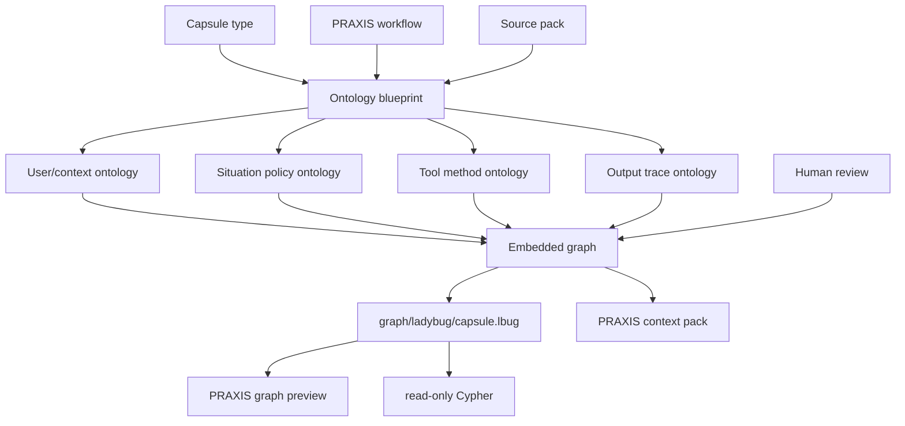

See [docs/EMBEDDED_GRAPH_AND_SEMANTIC_LAYER.md](docs/EMBEDDED_GRAPH_AND_SEMANTIC_LAYER.md).
See [docs/ONTOLOGY_BLUEPRINTS.md](docs/ONTOLOGY_BLUEPRINTS.md) for the
capsule-specific ontology planner and CLI command.

<p align="center">
  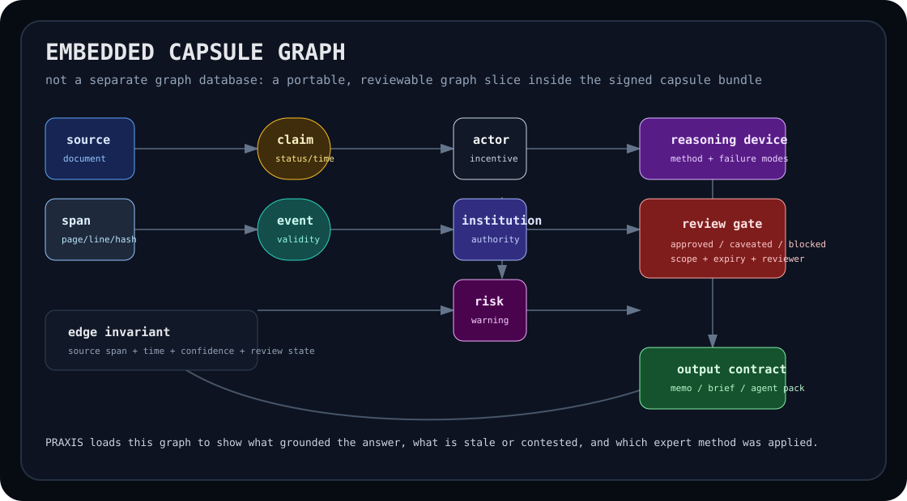
</p>

## Human-Gated Expert Layer

DIALECTICA should capture expert reasoning as structured data:

- source hierarchies and citation standards;
- tacit domain distinctions;
- approved terminology and forbidden framings;
- missing-actor warnings;
- rejected causal stories;
- reviewer caveats and expiry dates;
- reasoning devices and failure modes;
- rights and sharing constraints.

That is how PRAXIS can guide agents to reason with expert constraints rather
than only retrieve expert facts.

```text
machine extraction
      |
      v
review queue -> expert caveat -> review ledger -> promoted capsule
      |                              |
      v                              v
rejected object                 marketplace listing
```

See [docs/EXPERT_REVIEW_AND_MARKETPLACE.md](docs/EXPERT_REVIEW_AND_MARKETPLACE.md)
and [docs/CAPSULE_BUILD_EXAMPLES.md](docs/CAPSULE_BUILD_EXAMPLES.md).

## Human-Gated Language

Policy work often fails through language before it fails through facts. A
capsule therefore carries a language profile, not just an output style hint.

The language profile can include:

- approved terms and definitions;
- terms that require caveats or jurisdictional qualifiers;
- forbidden framings, euphemisms, overclaims, and misleading labels;
- preferred audience register for ministers, analysts, executives, or public
  communication;
- multilingual terminology and translation notes;
- quote, citation, and uncertainty language rules;
- reviewer decisions that approve, caveat, or reject language choices.

This lets PRAXIS hand the model both the knowledge and the disciplined language
for using that knowledge.

## Deployment Direction

Start on **Cloud Run**, not Kubernetes.

Cloud Run is the right initial substrate because DIALECTICA needs containerized
API services, event-driven workers, jobs, Cloud SQL access, managed scaling, and
low operational overhead before it needs cluster-level control. Current Google
Cloud docs describe Cloud Run as a container platform with services, jobs, and
worker pools. Services fit API and HTTP task-handler traffic. Jobs fit bounded
backfill/eval/reindex work. Worker pools are useful later for continuous
pull-based workers, but they should not be the first runtime dependency.

Recommended first deployment:

- Cloud Run service: `dialectica-api`
- Cloud Run service: `dialectica-task-handler`
- Cloud Run jobs: `capsule-backfill`, `capsule-eval`, `source-reindex`
- Cloud Tasks queues: durable ingestion, compile, review, and export work
- Pub/Sub topics: optional fanout for long-running ingestion and live updates
- Cloud SQL PostgreSQL: operational capsule store
- Cloud Storage: source artifacts and capsule bundles
- Secret Manager: API keys, model credentials, signing keys
- Artifact Registry: container images
- Cloud Build or GitHub Actions: build, test, scan, deploy

Use **GKE Autopilot later** if the engine proves it needs Kubernetes-native
scheduling, long-running clustered graph services, custom network policies,
operator-managed infrastructure, or hardware-specific workloads. Google Cloud
documents Cloud Run and GKE as portable container runtimes, which keeps this
choice reversible if the system outgrows Cloud Run.

Primary source anchors:

- Cloud Run overview:
  <https://docs.cloud.google.com/run/docs/overview/what-is-cloud-run>
- Cloud Run to Cloud SQL for PostgreSQL:
  <https://docs.cloud.google.com/sql/docs/postgres/connect-run>
- Cloud Tasks HTTP target tasks:
  <https://docs.cloud.google.com/tasks/docs/creating-http-target-tasks>
- GKE and Cloud Run comparison:
  <https://docs.cloud.google.com/kubernetes-engine/docs/concepts/gke-and-cloud-run>
- GKE Autopilot overview:
  <https://docs.cloud.google.com/kubernetes-engine/docs/concepts/autopilot-overview>

See [docs/DEPLOYMENT.md](docs/DEPLOYMENT.md) for the full deployment decision.

## Benchmark-Informed Position

The current AI memory and knowledge-graph ecosystem points to four useful
patterns:

| Pattern | What to learn | DIALECTICA stance |
| --- | --- | --- |
| Temporal context graphs | Time, provenance, and evolving facts matter for agents operating on changing facts. | Adopt temporal/provenance semantics, but keep Postgres and bundle export canonical. |
| Agent memory layers | Agents need durable user/session/project state. | Capture memory as reviewed capsule records, not uncontrolled chat memory. |
| GraphRAG pipelines | Graph structure improves synthesis over private corpora. | Use graph slices and evals, but avoid expensive batch graph dependency for foundation build. |
| Agent orchestration runtimes | Long-running workflows need persistence, human gates, and traces. | PRAXIS owns visible agent runs; DIALECTICA supplies capsule context and receipts. |

See [docs/TECH_BENCHMARK.md](docs/TECH_BENCHMARK.md) for sources and lessons
from Graphiti/Zep, Cognee, Mem0, Khoj, Letta, Microsoft GraphRAG, LangGraph,
MCP, and the OpenAI Agents SDK.

## Research Memory

Future agents should not rediscover the same architecture from scratch. The
repo keeps a durable research ledger that turns source links into design
conclusions, refresh triggers, and implementation constraints.

<p align="center">
  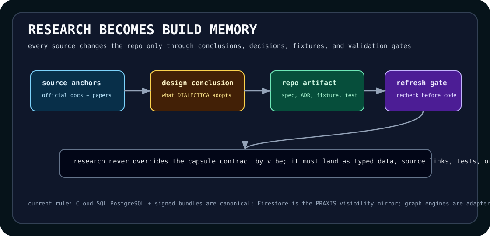
</p>

Start from [docs/RESEARCH_LEDGER.md](docs/RESEARCH_LEDGER.md) before adding a
graph, memory, MCP, ontology, agent, or cloud adapter. The current conclusion is
clear: the signed capsule bundle and Cloud SQL PostgreSQL records are
canonical; Firestore is the PRAXIS visibility mirror; Ladybug is the required
embedded graph projection for promoted capsules; vector/MCP/memory systems are
derived adapters until an ADR and eval evidence promote them.

## Repository Map

Keep the README as the front door, not the full table of contents.

| Area | Start here |
| --- | --- |
| Active build control | [docs/CODING_LEDGER.md](docs/CODING_LEDGER.md) |
| Current implementation plan | [docs/NEXT_CODE_BUILD_PLAN.md](docs/NEXT_CODE_BUILD_PLAN.md) |
| Complete documentation index | [docs/README.md](docs/README.md) |
| Exact directory ownership | [docs/REPOSITORY_STRUCTURE.md](docs/REPOSITORY_STRUCTURE.md) |
| Architecture decisions | [docs/decisions/](docs/decisions) |
| Contract fixtures | [fixtures/README.md](fixtures/README.md) |
| Rust crate ownership | [crates/README.md](crates/README.md) |
| Services | [services/README.md](services/README.md) |

## Build Principles

1. Contract first: capsule schema, provenance, review, and export are the first
   product.
2. Source-cited always: every derived claim must point back to source material
   or expert review.
3. Temporal by default: policy context changes; capsules must carry dates,
   freshness, supersession, and uncertainty.
4. Postgres first: keep the foundation build operational store simple, inspectable, and
   migratable.
5. Ladybug embedded graph: promoted capsules carry `graph/ladybug/capsule.lbug`
   for read-only Cypher and PRAXIS graph previews, while `graph.jsonld` remains
   the rebuildable semantic graph contract.
6. Human-gated promotion: expert review is a first-class capability, not a
   future admin screen.
7. PRAXIS-compatible output: every capsule should be useful to PRAXIS agentic
   workflows without special pleading.

## Current Status

This repository is at **Phase 2: local executable capsule build loop**.

The Rust workspace now has its first executable capsule-contract and input
contract slice. It can validate and inspect a canonical v3 Situation Capsule
fixture, keep the legacy policy fixture passing during migration, validate a
source pack, validate fixture-mode extraction proposals, route review triggers,
validate reviewer decisions, normalize promoted records, print a build plan,
compile a deterministic v3 package, write a deterministic `.capsule` archive,
export a PRAXIS context pack, diff package versions into cited change memos,
verify signed package integrity envelopes, serve fixture-backed Axum API
routes, and export JSON Schema snapshots. Live model-provider calls, durable
storage, PRAXIS frontend integration, and cloud deployment wait until this
local build loop is hardened with typed elicitation protocols, composition
contracts, store-backed jobs, and ingestion adapters.

Start here:

1. [Source of Truth](docs/SOURCE_OF_TRUTH.md): document priority, naming, and
   foundation constraints.
2. [Coding Ledger](docs/CODING_LEDGER.md): active build lanes and command
   gates.
3. [Next Code Build Plan](docs/NEXT_CODE_BUILD_PLAN.md): the next executable
   implementation sequence.
4. [LLM Context Extraction Architecture](docs/LLM_CONTEXT_EXTRACTION_ARCHITECTURE.md):
   how LLM extraction, graph building, and human gates should work.
5. [Missing Work Audit 2026-06-08](docs/MISSING_WORK_AUDIT_2026_06_08.md):
   complete missing-build checklist.
6. [Code Audit 2026-06-08](docs/CODE_AUDIT_2026_06_08.md): what is coded,
   verified, and not built yet.
7. [Post-Build Audit 2026-06-08](docs/POST_BUILD_AUDIT_2026_06_08.md):
   current audit, missing work, and next coding prompt.
8. [Code Quality Tooling](docs/CODE_QUALITY_TOOLING.md): Graphify, Serena,
   ECC/Codex skills, and verification loop.
9. [Codex MCP Capsule Builder](docs/CODEX_MCP_CAPSULE_BUILDER.md): local CLI
   and MCP build loop for PRAXIS capsule artifacts.
10. [Capsule Spec](docs/CAPSULE_SPEC.md): portable bundle contract.
11. [Engineering Baseline](docs/ENGINEERING_BASELINE.md): crate ownership and
   command gates.
12. [Improvement Guidelines](docs/IMPROVEMENT_GUIDELINES.md): current gaps and
   quality bar.
13. [Scaffold Audit](docs/SCAFFOLD_AUDIT.md): what is real now, what is still
   missing, and what blocks the functional engine.

Use [docs/README.md](docs/README.md) for the full documentation index and
[docs/DIALECTICA_v3_BUILD_INSTRUCTIONS.md](docs/DIALECTICA_v3_BUILD_INSTRUCTIONS.md)
as reference context.

## First Build Commands

These commands are active now.

```powershell
cargo fmt --all -- --check
cargo check --locked --workspace --all-targets
cargo clippy --locked --workspace --all-targets -- -D warnings
cargo test --locked --workspace
cargo run -p dialectica-cli -- welcome
cargo run -p dialectica-cli -- build-docs --type situation --input .\docs --out $env:TEMP\dialectica-doc-capsule --title "Local Situation Capsule" --workflow decision_brief
cargo run -p dialectica-cli -- inspect $env:TEMP\dialectica-doc-capsule\package
cargo run -p dialectica-cli -- mcp-config
cargo run -p dialectica-cli -- doctor
cargo run -p dialectica-cli -- validate fixtures/canonical-capsules/conflict-situation-capsule
cargo run -p dialectica-cli -- inspect fixtures/canonical-capsules/conflict-situation-capsule
cargo run -p dialectica-cli -- ladybug-check fixtures/canonical-capsules/conflict-situation-capsule
cargo run -p dialectica-cli --features ladybug -- ladybug-query fixtures/canonical-capsules/conflict-situation-capsule "MATCH (n:CapsuleNode) RETURN count(n) AS node_count;"
cargo run -p dialectica-cli -- validate fixtures/golden-policy-capsule/expected-bundle
cargo run -p dialectica-cli -- inspect fixtures/golden-policy-capsule/expected-bundle
cargo run -p dialectica-cli -- ontology-plan fixtures/golden-policy-capsule/expected-bundle
cargo run -p dialectica-cli -- source-pack-check fixtures/golden-policy-capsule/source-pack/source_pack.json
cargo run -p dialectica-cli -- proposal-check fixtures/golden-policy-capsule/build_request.json fixtures/golden-policy-capsule/source-pack/source_pack.json fixtures/golden-policy-capsule/proposals
cargo run -p dialectica-cli -- build-plan fixtures/golden-policy-capsule/build_request.json fixtures/golden-policy-capsule/source-pack/source_pack.json fixtures/golden-policy-capsule/proposals
cargo run -p dialectica-cli -- review-check fixtures/golden-policy-capsule/build_request.json fixtures/golden-policy-capsule/source-pack/source_pack.json fixtures/golden-policy-capsule/proposals fixtures/golden-policy-capsule/review-decisions
cargo run -p dialectica-cli -- promote-check fixtures/golden-policy-capsule/build_request.json fixtures/golden-policy-capsule/source-pack/source_pack.json fixtures/golden-policy-capsule/proposals fixtures/golden-policy-capsule/review-decisions
cargo run -p dialectica-cli -- build-fixture fixtures/golden-policy-capsule --out $env:TEMP\dialectica-golden-v3
cargo run -p dialectica-cli -- validate $env:TEMP\dialectica-golden-v3
cargo run -p dialectica-cli -- archive $env:TEMP\dialectica-golden-v3 --out $env:TEMP\dialectica-golden-v3.capsule
cargo run -p dialectica-cli -- context-pack $env:TEMP\dialectica-golden-v3 --workflow conflict_map
cargo run -p dialectica-cli -- schema-export schemas/capsule-3.0
python -m compileall tools/python
python -m unittest discover tools/python/tests
```

The first local runtime must not require cloud credentials. Cloud credentials
arrive only when staging deployment begins. `clippy` is already a blocking local
and CI gate.

## License

Licensed under the [Apache License 2.0](LICENSE).

Please preserve the TACITUS attribution notice in [NOTICE](NOTICE). If you use
DIALECTICA in research, benchmarks, public demos, products, or derivative
capsule-engine work, cite the project using [CITATION.cff](CITATION.cff).
