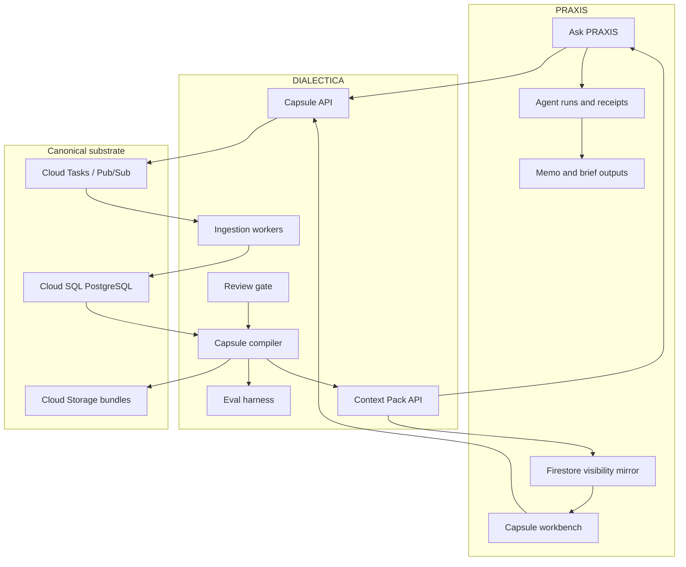
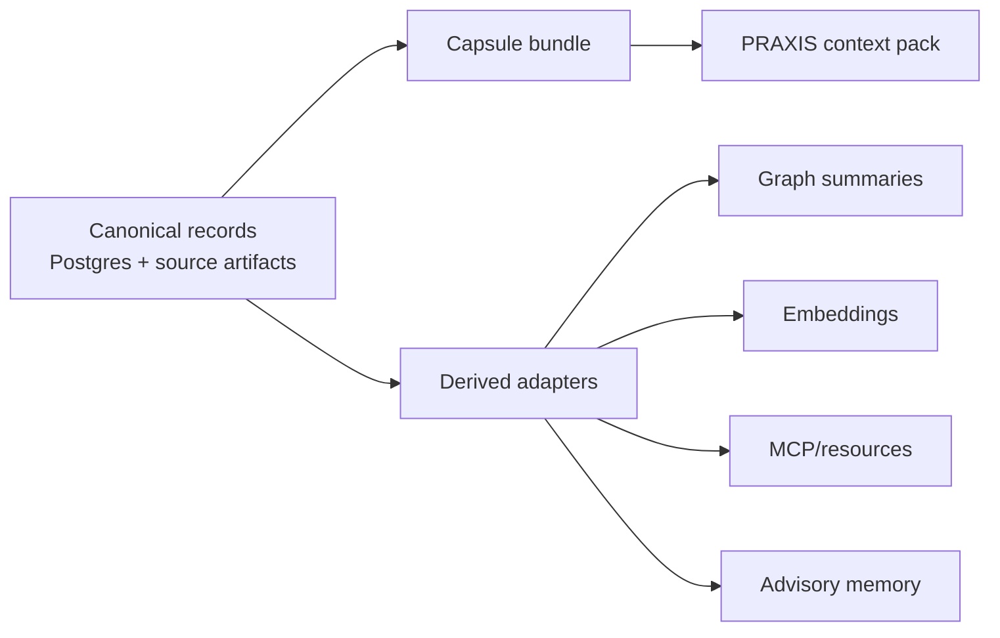
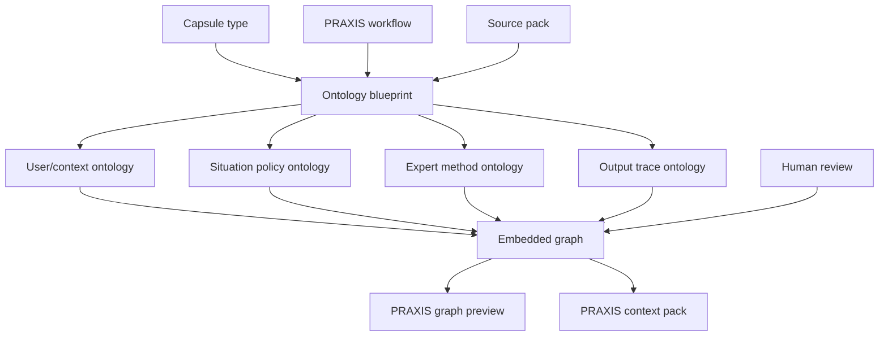

<p align="center">
  
</p>


DIALECTICA is the TACITUS context-capsule engine for PRAXIS.

Its job is to build the context-capsule backbone for PRAXIS: durable,
source-grounded knowledge objects that humans and AI agents can inspect, share,
compose, and use interchangeably across policy, research, analysis, drafting,
scenario, and decision workflows.

The product thesis is:

> PRAXIS Augmented Generation with PRAXIS Capsules by TACITUS.

The technical thesis is:

> A capsule is a signed, portable, self-describing knowledge-work object: a
> model of a situation, the evidence behind it, the reasoning tools for using
> it, and the rules for human and AI use.

## Why This Matters

Generic LLMs are good at producing plausible text from loose context.
DIALECTICA is built for the harder problem: preserving the context that makes a
policy answer usable after the chat window closes.

- **For policy teams**: a capsule keeps sources, dates, caveats, reasoning
  method, reviewed language, and output scope together.
- **For engineers**: a capsule is a typed, signed, testable contract with
  provenance, graph slices, review gates, and PRAXIS-facing APIs.
- **For investors and operators**: capsules create a defensible knowledge layer
  for PRAXIS, where expert-reviewed context, methods, and language can become a
  reusable library rather than one-off prompt work.

The ambition is not just better retrieval. It is a backbone for knowledge work:
human-gated knowledge, tacit expert reasoning, and reviewed language that can be
handed to agentic workflows without losing provenance or judgment.

## About

DIALECTICA exists because serious knowledge work needs a shared object between
people and AI agents. Policy teams do not only need answers. They need the
source trail, temporal status, institutional context, contested claims, expert
reasoning, reviewed language, review caveats, and output rules that make an
answer usable.

The capsule is that object.

```text
                   DIALECTICA by TACITUS

     docs + feeds + notes + interactions + expert judgement
             |
             v
  +------------------------------------------------------+
  | PRAXIS Capsule                                      |
  |                                                      |
  | source ledger -> temporal ledger -> semantic plan    |
  |       |                |                 |           |
  |       v                v                 v           |
  | source spans ---- embedded graph ---- reasoning      |
  |       |                |          language profile   |
  |       |                |                 |           |
  |       +---------- human review gate -----+           |
  |                         |                            |
  |                  output contracts                    |
  +------------------------------------------------------+
             |
             v
      PRAXIS agents, analysts, reviewers, memos, briefs
```

The larger vision is that capsules become infrastructure for knowledge work: a
policy analyst, expert reviewer, AI agent, and institution can point to the
same capsule and see the same evidence, graph, reasoning layer, caveats, rights,
and usage constraints.

<p align="center">
  
</p>

See [docs/ABOUT_DIALECTICA.md](docs/ABOUT_DIALECTICA.md) for the product
definition.

<p align="center">
  
</p>

<p align="center">
  
</p>

## TACITUS System Map

```text
TACITUS
  |
  +-- PRAXIS       visible cockpit for policy work and agentic workflows
  |
  +-- DIALECTICA   context-capsule engine that builds PRAXIS Capsules
  |
  +-- AGON         future perception and signal subsystem
  |
  +-- KAIROS       future temporal/situational timing subsystem
```

PRAXIS is what users operate. DIALECTICA is the engine that makes PRAXIS
answers more inspectable, source-faithful, temporally aware, and expert-shaped.
The repo therefore optimizes for a backend that can build, improve, validate,
sign, store, combine, and serve capsules.

## What DIALECTICA Builds

DIALECTICA does not build another chatbot memory layer. It builds capsules that
carry the durable knowledge structure that policy teams need:

- the user, team, institution, mandate, audience, and decision horizon;
- the capsule-specific situation, user, source, tool, output, domain, or expert
  context that matters for the workflow;
- actors, constraints, incentives, claims, uncertainties, and live-world
  changes when the capsule type requires them;
- source ledgers, citations, document spans, provenance, and trust status;
- temporal state: true now, stale, superseded, contested, predicted, or unknown;
- ontologies, semantic layers, entity graphs, causal links, and competing
  frames;
- expert reasoning devices, policy heuristics, philosophical lenses, analytic
  tradecraft, and review notes;
- reviewed language profiles: approved terms, audience register, voice,
  forbidden framings, translation notes, and diplomatic constraints;
- output contracts for memos, briefings, scenarios, plans, model cards, and
  PRAXIS agent workflows;
- human review gates, audit receipts, and capsule version history.

The point is interchangeability: a human analyst should be able to open the
capsule, understand the same knowledge structure that an AI agent receives, and
decide whether it is fit for a specific workflow.

## Relationship to PRAXIS

PRAXIS remains the visible cockpit. DIALECTICA supplies the capsule backbone.



Public product language should say **PRAXIS Capsules**, **Capsules**, **Capsule
AI**, or **Capsule Library**. Use **DIALECTICA Engine** for internal
architecture and implementation docs.

## Build Architecture

The first working version is contract-first and engine-light before it becomes
engine-rich. The capsule bundle format, provenance model, review ledger, graph
slice, semantic layer, and PRAXIS integration contract must work before
advanced graph/AI adapters become required.

Core services:

- **Capsule API**: creates capsule jobs, returns capsule manifests, exposes
  bundle metadata, and serves PRAXIS integration endpoints.
- **Ingestion workers**: parse documents, normalize source spans, extract
  entities, detect temporal claims, and write provenance records.
- **Capsule compiler**: assembles capsule bundles from canonical records,
  review decisions, ontology slices, graph summaries, and retrieval packs.
- **Review gate**: records human approvals, rejections, expert notes, red-team
  findings, and promotion decisions.
- **Evaluation harness**: tests source fidelity, temporal accuracy, retrieval
  quality, reasoning transfer, and PRAXIS answer improvement.

Current coding scaffold:

```text
Cargo workspace
  crates/dialectica-capsule       contract types and validation
  crates/dialectica-compiler      deterministic bundle assembly
  crates/dialectica-store         PostgreSQL repositories and migrations
  crates/dialectica-eval          quality and outcome checks
  crates/dialectica-cli           local validation and fixture commands
  services/dialectica-api         PRAXIS-facing API
  services/dialectica-task-handler Cloud Tasks entrypoint
  tests/dialectica-contract-tests workspace contract tests
```

Start coding from [docs/CODING_LEDGER.md](docs/CODING_LEDGER.md). Read
[docs/SCAFFOLD_AUDIT.md](docs/SCAFFOLD_AUDIT.md) before claiming that any slice
is functional. The next implementation sequence is in
[docs/NEXT_CODE_BUILD_PLAN.md](docs/NEXT_CODE_BUILD_PLAN.md), and the active
gap-control standard is in
[docs/IMPROVEMENT_GUIDELINES.md](docs/IMPROVEMENT_GUIDELINES.md).

Current executable surface:

```powershell
cargo run -p dialectica-cli -- doctor
cargo run -p dialectica-cli -- validate fixtures/golden-policy-capsule/expected-bundle
cargo run -p dialectica-cli -- inspect fixtures/golden-policy-capsule/expected-bundle
cargo run -p dialectica-cli -- ontology-plan fixtures/golden-policy-capsule/expected-bundle
cargo run -p dialectica-cli -- schema-export schemas/capsule-0.1.0
```

This proves the repository is not only product copy. It already has typed Rust
capsule contracts, validation, schema export, a golden policy fixture, and a
capsule-specific ontology planner.

Initial runtime promise:

> Given a small policy source pack and a review decision, DIALECTICA can compile
> a valid PRAXIS Capsule bundle that PRAXIS can use to produce a more grounded,
> more temporally aware, more source-faithful policy answer than raw prompting.

Canonical stores:

- **Cloud SQL PostgreSQL** for capsule metadata, source ledger, entities,
  temporal facts, review states, job state, and pgvector-ready embeddings.
- **Cloud Storage** for immutable source artifacts and signed capsule bundles.
- **Firestore adapter** where PRAXIS needs capsule visibility in its current
  user-facing surfaces.
- Optional graph/semantic adapters only after the base contract is stable.

## Capsule Formal Model

At initial runtime scale, a capsule is:

```text
Capsule = Identity + Context + Sources + Time + Ontology Blueprint + Graph
        + Reasoning Devices + Language Profile + Agent Guidance + Retrieval Pack
        + Output Contracts + Review Ledger + Evaluation Report + Signature
```

The ontology and graph are capsule-specific. A situation capsule may need an
actor/claim/time graph. A user capsule may need role, authority, preference,
privacy, and output-style semantics. A thinking-device capsule may need method
steps, inputs, failure modes, and review caveats. A source capsule may need
source-proof semantics. DIALECTICA keeps shared graph classes for
interoperability, but every capsule develops the semantic layers that fit its
matter and intended PRAXIS workflows.

```text
capsule type + workflow + source pack
        |
        v
ontology blueprint
        |
        +--> local terms, frames, aliases, caveats
        +--> graph profile and PRAXIS lens
        +--> reasoning questions and review gates
        |
        v
portable capsule context
```

The most important distinction is between **canonical records** and **derived
adapters**.



Graph, vector, MCP, and memory planes can make retrieval better, but they do not
replace the capsule bundle or PostgreSQL ledger in the foundation build.

## Capsule Types

PRAXIS should not receive one generic context object. DIALECTICA should build
typed capsules with clear compatibility rules:

| Capsule | What it packages | Example use |
| --- | --- | --- |
| User Capsule | user preferences, style, mandate, prior work | personalized Ask PRAXIS |
| Team Capsule | institutional memory and workflow standards | team briefing lane |
| Situation Capsule | actors, claims, time, risks, sources | live policy analysis |
| Source Capsule | document spans, trust, provenance | citation-grounded retrieval |
| Domain Capsule | concepts, authorities, instruments | policy-domain onboarding |
| Thinking Device Capsule | expert method and failure modes | stakeholder analysis or ACH |
| Stakeholder Capsule | actors, incentives, constraints, influence | stakeholder maps |
| Scenario Capsule | futures, triggers, indicators, branches | foresight and contingency |
| Output Capsule | produced artifact plus reasoning trail | memo reuse and handover |
| Expert Pick Capsule | reviewed capsule recommended by an expert | capsule marketplace |

Example composition:

```text
Situation Capsule
  + Source Capsule
  + Stakeholder Capsule
  + Thinking Device Capsule
  + Expert Pick Capsule
  -> PRAXIS decision brief with source receipts and graph warnings
```

See [docs/CAPSULE_TYPES_AND_MARKETPLACE.md](docs/CAPSULE_TYPES_AND_MARKETPLACE.md).
See [docs/CAPSULE_STRUCTURE_GUIDE.md](docs/CAPSULE_STRUCTURE_GUIDE.md) for the
bundle layer guide and [fixtures/example-capsules](fixtures/example-capsules)
for four concrete capsule examples.

## Embedded Graph

The embedded graph is the capsule's internal map. It is shaped by the ontology
blueprint, then normalized into shared classes that PRAXIS can render, combine,
and audit:

- nodes: actors, institutions, sources, spans, claims, events, concepts,
  instruments, risks, decisions, reasoning devices, output contracts, rights
  policies, and review actions;
- edges: supports, contradicts, mentions, influences, causes, depends on,
  supersedes, uses device, reviewed by, and forbidden for;
- every edge carries provenance, temporal scope, confidence, review state, and
  an explanation;
- JSON-LD, PROV-O, SKOS, SHACL, ODRL, VC/DID, and OPA are design anchors, not
  mandatory runtime dependencies.



See [docs/EMBEDDED_GRAPH_AND_SEMANTIC_LAYER.md](docs/EMBEDDED_GRAPH_AND_SEMANTIC_LAYER.md).
See [docs/ONTOLOGY_BLUEPRINTS.md](docs/ONTOLOGY_BLUEPRINTS.md) for the
capsule-specific ontology planner and CLI command.

<p align="center">
  
</p>

## Human-Gated Expert Layer

DIALECTICA should capture expert reasoning as structured data:

- source hierarchies and citation standards;
- tacit domain distinctions;
- approved terminology and forbidden framings;
- missing-actor warnings;
- rejected causal stories;
- reviewer caveats and expiry dates;
- reasoning devices and failure modes;
- rights and sharing constraints.

That is how PRAXIS can guide agents to reason with expert constraints rather
than only retrieve expert facts.

```text
machine extraction
      |
      v
review queue -> expert caveat -> review ledger -> promoted capsule
      |                              |
      v                              v
rejected object                 marketplace listing
```

See [docs/EXPERT_REVIEW_AND_MARKETPLACE.md](docs/EXPERT_REVIEW_AND_MARKETPLACE.md)
and [docs/CAPSULE_BUILD_EXAMPLES.md](docs/CAPSULE_BUILD_EXAMPLES.md).

## Human-Gated Language

Policy work often fails through language before it fails through facts. A
capsule therefore carries a language profile, not just an output style hint.

The language profile can include:

- approved terms and definitions;
- terms that require caveats or jurisdictional qualifiers;
- forbidden framings, euphemisms, overclaims, and misleading labels;
- preferred audience register for ministers, analysts, executives, or public
  communication;
- multilingual terminology and translation notes;
- quote, citation, and uncertainty language rules;
- reviewer decisions that approve, caveat, or reject language choices.

This lets PRAXIS hand the model both the knowledge and the disciplined language
for using that knowledge.

## Deployment Direction

Start on **Cloud Run**, not Kubernetes.

Cloud Run is the right initial substrate because DIALECTICA needs containerized
API services, event-driven workers, jobs, Cloud SQL access, managed scaling, and
low operational overhead before it needs cluster-level control. Current Google
Cloud docs describe Cloud Run as a container platform with services, jobs, and
worker pools. Services fit API and HTTP task-handler traffic. Jobs fit bounded
backfill/eval/reindex work. Worker pools are useful later for continuous
pull-based workers, but they should not be the first runtime dependency.

Recommended first deployment:

- Cloud Run service: `dialectica-api`
- Cloud Run service: `dialectica-task-handler`
- Cloud Run jobs: `capsule-backfill`, `capsule-eval`, `source-reindex`
- Cloud Tasks queues: durable ingestion, compile, review, and export work
- Pub/Sub topics: optional fanout for long-running ingestion and live updates
- Cloud SQL PostgreSQL: operational capsule store
- Cloud Storage: source artifacts and capsule bundles
- Secret Manager: API keys, model credentials, signing keys
- Artifact Registry: container images
- Cloud Build or GitHub Actions: build, test, scan, deploy

Use **GKE Autopilot later** if the engine proves it needs Kubernetes-native
scheduling, long-running clustered graph services, custom network policies,
operator-managed infrastructure, or hardware-specific workloads. Google Cloud
documents Cloud Run and GKE as portable container runtimes, which keeps this
choice reversible if the system outgrows Cloud Run.

Primary source anchors:

- Cloud Run overview:
  <https://docs.cloud.google.com/run/docs/overview/what-is-cloud-run>
- Cloud Run to Cloud SQL for PostgreSQL:
  <https://docs.cloud.google.com/sql/docs/postgres/connect-run>
- Cloud Tasks HTTP target tasks:
  <https://docs.cloud.google.com/tasks/docs/creating-http-target-tasks>
- GKE and Cloud Run comparison:
  <https://docs.cloud.google.com/kubernetes-engine/docs/concepts/gke-and-cloud-run>
- GKE Autopilot overview:
  <https://docs.cloud.google.com/kubernetes-engine/docs/concepts/autopilot-overview>

See [docs/DEPLOYMENT.md](docs/DEPLOYMENT.md) for the full deployment decision.

## Benchmark-Informed Position

The current AI memory and knowledge-graph ecosystem points to four useful
patterns:

| Pattern | What to learn | DIALECTICA stance |
| --- | --- | --- |
| Temporal context graphs | Time, provenance, and evolving facts matter for agents operating on changing facts. | Adopt temporal/provenance semantics, but keep Postgres and bundle export canonical. |
| Agent memory layers | Agents need durable user/session/project state. | Capture memory as reviewed capsule records, not uncontrolled chat memory. |
| GraphRAG pipelines | Graph structure improves synthesis over private corpora. | Use graph slices and evals, but avoid expensive batch graph dependency for foundation build. |
| Agent orchestration runtimes | Long-running workflows need persistence, human gates, and traces. | PRAXIS owns visible agent runs; DIALECTICA supplies capsule context and receipts. |

See [docs/TECH_BENCHMARK.md](docs/TECH_BENCHMARK.md) for sources and lessons
from Graphiti/Zep, Cognee, Mem0, Khoj, Letta, Microsoft GraphRAG, LangGraph,
MCP, and the OpenAI Agents SDK.

## Research Memory

Future agents should not rediscover the same architecture from scratch. The
repo keeps a durable research ledger that turns source links into design
conclusions, refresh triggers, and implementation constraints.

<p align="center">
  
</p>

Start from [docs/RESEARCH_LEDGER.md](docs/RESEARCH_LEDGER.md) before adding a
graph, memory, MCP, ontology, agent, or cloud adapter. The current conclusion is
clear: the signed capsule bundle and Cloud SQL PostgreSQL records are
canonical; Firestore is the PRAXIS visibility mirror; graph/vector/MCP/memory
systems are derived adapters until an ADR and eval evidence promote them.

## Repository Map

```text
assets/
  dialectica-mark.svg                    GitHub README mark
  capsule-stack.svg                      capsule stack diagram
  embedded-graph.svg                     embedded graph diagram
  agent-build-flow.svg                   build order diagram for future agents
  research-ledger.svg                    research-memory diagram
Cargo.toml                               Rust workspace scaffold
CITATION.cff                             citation metadata for GitHub and research use
NOTICE                                   TACITUS attribution and citation notice
docs/
  DIALECTICA_v3_BUILD_INSTRUCTIONS.md   imported reference context
  ABOUT_DIALECTICA.md                   product definition and backbone story
  SOURCE_OF_TRUTH.md                    document priority and working rules
  CODING_LEDGER.md                      active coding control file
  ENGINEERING_BASELINE.md               Rust/Python ownership and command gates
  LANE_A_ACCEPTANCE.md                  exact first schema lane acceptance
  API_SLICE_1.md                        exact first API slice contract
  GRAPH_PROFILE_REGISTRY.md             canonical graph vocabulary
  SCAFFOLD_AUDIT.md                     repo readiness and gap audit
  FOUNDATION_BUILD.md                   first product slice and non-goals
  TECH_BENCHMARK.md                      research and ecosystem comparison
  GRAPH_ONTOLOGY_RESEARCH_NOTES.md       graph, ontology, Ladybug, and standards research
  ONTOLOGY_BLUEPRINTS.md                 capsule-specific semantic planner
  RESEARCH_LEDGER.md                     source links, conclusions, and refresh triggers
  AGENT_BUILD_GUIDE.md                   practical build order for future agents
  NEXT_CODE_BUILD_PLAN.md                concrete next coding phases
  IMPROVEMENT_GUIDELINES.md              active gaps, quality bar, and improvement protocol
  IMPLEMENTATION_PHASE_PLAN.md           active phased coding plan
  CAPSULE_STRUCTURE_GUIDE.md             bundle layers and agent guidance contract
  GITHUB_PROFILE.md                      recommended GitHub About metadata and topics
  REPOSITORY_CONCEPT_REVIEW.md            concept, narrative, and repo coherence audit
  CAPSULE_FORMAL_MODEL.md                formal capsule layers and invariants
  CAPSULE_TYPES_AND_MARKETPLACE.md       capsule categories and market object
  EMBEDDED_GRAPH_AND_SEMANTIC_LAYER.md   graph, ontology, and semantics
  EXPERT_REVIEW_AND_MARKETPLACE.md       human gates and expert trust model
  CAPSULE_BUILD_EXAMPLES.md              concrete policy capsule examples
  INTELLECTUAL_TOOLS.md                  policy reasoning devices and capture
  ARCHITECTURE.md                       system architecture and data flow
  API_CONTRACT.md                        API endpoints PRAXIS will consume
  CAPSULE_SPEC.md                       capsule bundle contract
  DATA_MODEL.md                         PostgreSQL-first record model
  DEPLOYMENT.md                         Cloud Run first deployment plan
  PRAXIS_INTEGRATION.md                 PRAXIS handoff and API contract
  IMPLEMENTATION_BLUEPRINT.md           ordered engineering plan
  LOCAL_DEVELOPMENT.md                  local dev and fixture workflow
  CI_CD.md                              continuous integration and release gates
  REPOSITORY_STRUCTURE.md               ownership map for repo directories
  AGENTIC_WORKFLOWS.md                  Codex agent swarm lanes and gates
  PRAXIS_REPO_ALIGNMENT.md              integration seams from PRAXIS repo
  RESEARCH_BACKLOG.md                   research tracks for future improvement
  PYTHON_TOOLING.md                     auxiliary Python tool boundary
  AGENT_GUIDE.md                        build lanes for future agents
  BUILD_LEDGER.md                       decisions, tasks, and evidence trail
  DEPENDENCIES.md                       dependency candidates and constraints
  EVAL_PLAN.md                          quality gates and eval strategy
  OPERATIONS.md                         observability and runbooks
  ROADMAP.md                            staged build plan
  SECURITY_AND_PRIVACY.md               trust, privacy, and threat posture
  decisions/                            architecture decision records
crates/                                 Rust library and CLI crates
services/                               deployable Rust service binaries
infrastructure/                         Terraform/OpenTofu and deployment files
fixtures/                               test capsules, source packs, eval data
  example-capsules/                      small user/situation/tool/output examples
tests/                                  workspace contract tests
tools/                                  Python reports and local developer tooling
```

## Build Principles

1. Contract first: capsule schema, provenance, review, and export are the first
   product.
2. Source-cited always: every derived claim must point back to source material
   or expert review.
3. Temporal by default: policy context changes; capsules must carry dates,
   freshness, supersession, and uncertainty.
4. Postgres first: keep the foundation build operational store simple, inspectable, and
   migratable.
5. Graph as adapter: graph engines enrich the capsule, but they are not the only
   copy of truth.
6. Human-gated promotion: expert review is a first-class capability, not a
   future admin screen.
7. PRAXIS-compatible output: every capsule should be useful to PRAXIS agentic
   workflows without special pleading.

## Current Status

This repository is at **Phase 0: source-of-truth plus coding scaffold**.

The Rust workspace now has its first executable capsule-contract slice. It can
load a golden policy bundle, validate sourceability and graph/review/temporal
invariants, inspect the capsule summary, and export JSON Schema snapshots. The
next implementation step is to make the compiler generate the golden bundle
deterministically from source-pack records and review decisions before adding
storage, API routes, or model-powered extraction.

Start here:

1. Read [docs/SOURCE_OF_TRUTH.md](docs/SOURCE_OF_TRUTH.md).
2. Read [docs/ABOUT_DIALECTICA.md](docs/ABOUT_DIALECTICA.md).
3. Read [docs/CODING_LEDGER.md](docs/CODING_LEDGER.md).
4. Read [docs/ENGINEERING_BASELINE.md](docs/ENGINEERING_BASELINE.md).
5. Read [docs/LANE_A_ACCEPTANCE.md](docs/LANE_A_ACCEPTANCE.md).
6. Read [docs/API_SLICE_1.md](docs/API_SLICE_1.md).
7. Read [docs/GRAPH_PROFILE_REGISTRY.md](docs/GRAPH_PROFILE_REGISTRY.md).
8. Read [docs/SCAFFOLD_AUDIT.md](docs/SCAFFOLD_AUDIT.md).
9. Read [docs/CAPSULE_STRUCTURE_GUIDE.md](docs/CAPSULE_STRUCTURE_GUIDE.md).
10. Read [docs/GRAPH_ONTOLOGY_RESEARCH_NOTES.md](docs/GRAPH_ONTOLOGY_RESEARCH_NOTES.md).
11. Read [docs/RESEARCH_LEDGER.md](docs/RESEARCH_LEDGER.md).
12. Read [docs/AGENT_BUILD_GUIDE.md](docs/AGENT_BUILD_GUIDE.md).
13. Read [docs/REPOSITORY_CONCEPT_REVIEW.md](docs/REPOSITORY_CONCEPT_REVIEW.md).
14. Read [docs/IMPROVEMENT_GUIDELINES.md](docs/IMPROVEMENT_GUIDELINES.md).
15. Read [docs/GITHUB_PROFILE.md](docs/GITHUB_PROFILE.md).
16. Read [docs/FOUNDATION_BUILD.md](docs/FOUNDATION_BUILD.md).
17. Read [docs/CAPSULE_SPEC.md](docs/CAPSULE_SPEC.md).
18. Read [docs/CAPSULE_TYPES_AND_MARKETPLACE.md](docs/CAPSULE_TYPES_AND_MARKETPLACE.md).
19. Read [docs/EMBEDDED_GRAPH_AND_SEMANTIC_LAYER.md](docs/EMBEDDED_GRAPH_AND_SEMANTIC_LAYER.md).
20. Read [docs/CAPSULE_BUILD_EXAMPLES.md](docs/CAPSULE_BUILD_EXAMPLES.md).
21. Read [docs/API_CONTRACT.md](docs/API_CONTRACT.md).
22. Read [docs/ARCHITECTURE.md](docs/ARCHITECTURE.md).
23. Read [docs/IMPLEMENTATION_BLUEPRINT.md](docs/IMPLEMENTATION_BLUEPRINT.md).
24. Read [docs/INTELLECTUAL_TOOLS.md](docs/INTELLECTUAL_TOOLS.md).
25. Use [docs/DIALECTICA_v3_BUILD_INSTRUCTIONS.md](docs/DIALECTICA_v3_BUILD_INSTRUCTIONS.md) as reference context.

## First Build Commands

These commands are active now.

```powershell
cargo fmt --all -- --check
cargo check --locked --workspace --all-targets
cargo clippy --locked --workspace --all-targets -- -D warnings
cargo test --locked --workspace
cargo run -p dialectica-cli -- doctor
cargo run -p dialectica-cli -- validate fixtures/golden-policy-capsule/expected-bundle
cargo run -p dialectica-cli -- inspect fixtures/golden-policy-capsule/expected-bundle
cargo run -p dialectica-cli -- ontology-plan fixtures/golden-policy-capsule/expected-bundle
python -m compileall tools/python
python -m unittest discover tools/python/tests
```

The first local runtime must not require cloud credentials. Cloud credentials
arrive only when staging deployment begins. `clippy` becomes a blocking gate
after the dependency set and crate APIs stabilize.

## License

Licensed under the [Apache License 2.0](LICENSE).

Please preserve the TACITUS attribution notice in [NOTICE](NOTICE). If you use
DIALECTICA in research, benchmarks, public demos, products, or derivative
capsule-engine work, cite the project using [CITATION.cff](CITATION.cff).
