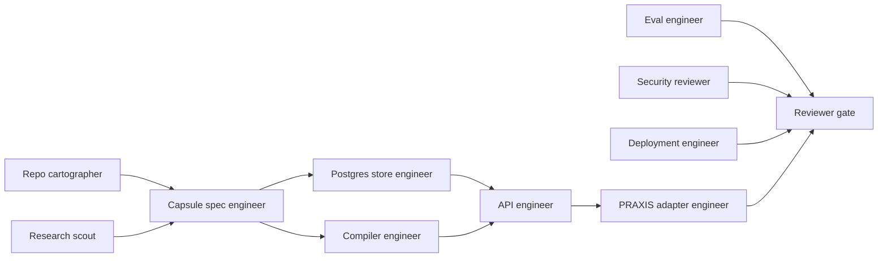

# Agentic Workflows

## Purpose

DIALECTICA should be built by multiple agents without losing architectural
control. This document defines build lanes, handoff rules, and validation gates.

## Agent Swarm Model

## Lanes

### Research Scout

Reads external docs, benchmarks memory/graph/RAG systems, and updates
`docs/RESEARCH_LEDGER.md`, `docs/TECH_BENCHMARK.md`, and
`docs/RESEARCH_BACKLOG.md`.

No-touch:

- implementation crates;
- deployment configs.

Output requirement:

- every source that changes the build direction gets a URL, checked date,
  conclusion, DIALECTICA decision, and refresh trigger in
  `docs/RESEARCH_LEDGER.md`.

### Capsule Spec Engineer

Owns:

- `docs/CAPSULE_FORMAL_MODEL.md`;
- `docs/CAPSULE_SPEC.md`;
- schema crate once created;
- fixture bundle validity.

### Store Engineer

Owns:

- `docs/DATA_MODEL.md`;
- migrations;
- repository interfaces;
- local Postgres workflow.

### Compiler Engineer

Owns:

- deterministic bundle assembly;
- checksums;
- signature metadata;
- PRAXIS context pack generation.

### PRAXIS Adapter Engineer

Owns:

- `docs/PRAXIS_REPO_ALIGNMENT.md`;
- API response compatibility;
- context-pack and capsule-set endpoints;
- Firestore mirror boundaries.

### Eval Engineer

Owns:

- golden fixture;
- source fidelity evals;
- temporal evals;
- reasoning-transfer evals;
- raw versus capsule-augmented PRAXIS comparison.

### Security Reviewer

Owns:

- prompt injection handling;
- tenant isolation;
- capsule export privacy;
- secrets;
- adapter threat models.

### Deployment Engineer

Owns:

- Dockerfile;
- Cloud Run service/job configs;
- Cloud SQL connectivity;
- Cloud Tasks dispatch;
- staging proof.

## Coordination Rules

- One lane owns each file during a session.
- Shared docs require a merge owner.
- Schema changes require fixture updates.
- API changes require PRAXIS alignment updates.
- Deployment changes require operations and security updates.
- No agent promotes optional graph or memory adapters without an ADR.
- Store, compiler, API, and eval implementation must not merge before Lane A
  acceptance is complete.
- Graph vocabulary changes must update `docs/GRAPH_PROFILE_REGISTRY.md`.

## Done Conditions

Every agent handoff should include:

- files changed;
- validation commands;
- unresolved assumptions;
- risks;
- next lane recommendation.

## First Parallel Work Plan

1. Spec engineer builds capsule Rust types and schema snapshots.
2. Eval engineer drafts golden fixture expectations without merging runtime code.
3. Graph engineer aligns graph profiles, aliases, and validation cases.
4. Store engineer plans migrations against the draft data model.
5. API engineer plans manifest, graph-preview, and context-pack routes.
6. Security reviewer audits source and capsule export boundaries.
7. Deployment engineer drafts local Docker and Cloud Run staging skeleton.

Merge order remains schema, fixture, validator, graph validation, store,
compiler, API, evals, deployment.
