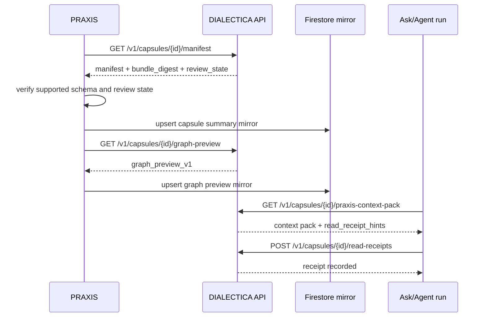

# PRAXIS Integration Contract

## Goal

PRAXIS should be able to request, inspect, combine, and use PRAXIS Capsules
without exposing DIALECTICA complexity to users.

The user should see a simple capsule library and stronger PRAXIS answers. The
engine can stay hidden.

## Integration Principles

- PRAXIS is the user-facing cockpit.
- DIALECTICA owns capsule compilation and canonical capsule artifacts.
- PRAXIS may mirror capsule metadata for UI speed.
- PRAXIS must not treat a capsule as trusted unless status and review gates pass.
- PRAXIS should expose source and review receipts when a capsule affects output.

Boundary:

- DIALECTICA PostgreSQL is canonical for capsule build, review, graph, export,
  and bundle state.
- PRAXIS Firestore remains canonical for PRAXIS user-facing capsule visibility,
  user library state, and cockpit UX state.
- Firestore mirrors must include the DIALECTICA `bundle_digest` and must be
  refreshed or invalidated when the digest changes.

## Minimal API Surface

### Create Capsule Job

```http
POST /v1/capsule-jobs
```

Use when PRAXIS starts a new capsule build.

Inputs:

- tenant;
- project;
- user;
- source references;
- target capsule type;
- intended workflows;
- review requirements.

Output:

- `job_id`
- `status`
- `next_poll_after`
- `links`

### Get Job

```http
GET /v1/capsule-jobs/{job_id}
```

Output:

- job status;
- current phase;
- errors;
- created records;
- review requirements;
- capsule id if compiled.

### Get Capsule Manifest

```http
GET /v1/capsules/{capsule_id}/manifest
```

Output:

- manifest fields;
- review state;
- freshness;
- source count;
- capsule type;
- graph preview metadata;
- rights and sharing summary;
- marketplace listing state when present;
- digest;
- compatible PRAXIS workflows.

### Get Graph Preview

```http
GET /v1/capsules/{capsule_id}/graph-preview
```

Output:

- `graph_preview_v1` payload;
- renderable nodes and edges;
- clusters;
- review styles;
- temporal filters;
- source receipt links;
- stale or unreviewed graph warnings.

### Get PRAXIS Context Pack

```http
GET /v1/capsules/{capsule_id}/praxis-context-pack
```

Output:

- compact summary;
- selected retrieval records;
- source hints;
- reasoning playbook subset;
- language profile rules;
- agent guidance policy;
- output contracts;
- warnings.

### Combine Capsules

```http
POST /v1/capsule-sets
```

Use when PRAXIS wants to concatenate multiple capsules into one workflow.

The response must include:

- compatibility warnings;
- conflicting claims;
- freshness warnings;
- combined retrieval plan;
- combined reasoning playbook summary.
- merged graph preview;
- rights and sharing conflicts.

## PRAXIS UI Requirements

PRAXIS should surface:

- capsule title and status;
- freshness and last compile time;
- source count and top source types;
- embedded graph preview;
- human review state;
- human-gated language profile;
- rights and sharing rules;
- expert-pick or marketplace state when present;
- warnings for stale or contested context;
- source receipts in answer views;
- capsule contribution in agent run receipts.

## Load Sequence



## Firestore Mirror Shape

PRAXIS mirror documents should be small and reconstructable:

```json
{
  "capsuleId": "cap_eu_energy_stakeholders_2026_q3",
  "tenantId": "tenant_123",
  "projectId": "project_123",
  "title": "EU industrial electricity support stakeholder map",
  "capsuleType": "stakeholder_capsule",
  "reviewState": "approved_with_caveats",
  "freshness": "current",
  "bundleDigest": "sha256:fixture",
  "schemaVersion": "0.1.0",
  "graphProfile": "stakeholder_graph_v1",
  "sourceCount": 8,
  "warningCount": 2,
  "compatibleWorkflows": ["stakeholder_map", "decision_brief"],
  "updatedAt": "2026-06-07T20:00:00Z"
}
```

Cache invalidation rule:

- if `bundleDigest` changes, PRAXIS must refresh manifest, graph preview,
  context-pack hints, and visible warnings before using the capsule.

PRAXIS should avoid exposing:

- internal DIALECTICA service names;
- raw extraction internals;
- graph engine implementation details;
- model provider internals unless needed for audit.

## Agent Workflow Requirements

When PRAXIS uses a capsule, the agent should receive:

- the capsule manifest;
- task-specific capsule summary;
- retrieval pack snippets;
- source and citation hints;
- temporal warnings;
- reasoning devices relevant to the requested output;
- agent guidance rules used by the model;
- forbidden claims and escalation criteria;
- output contract.
- graph focus nodes and edge warnings.

The agent should return:

- answer or artifact;
- capsule ids used;
- bundle digest used;
- source ids cited;
- claim ids cited;
- reasoning device ids applied;
- unresolved uncertainties;
- capsule warnings triggered;
- follow-up source gaps.

## Read Receipts

PRAXIS should record capsule read receipts when a capsule materially affects an
answer, memo, agent run, or handover.

Minimum receipt fields:

- PRAXIS run id or conversation id;
- capsule id;
- bundle digest;
- context pack version;
- source ids;
- claim ids;
- reasoning device ids;
- graph node and edge ids that influenced the answer;
- warnings triggered;
- review state at use time.

These receipts let DIALECTICA and PRAXIS measure which capsules improve real
workflows and which ones need review, refresh, or retirement.

## Capsule+ Compatibility

PRAXIS already has Capsule+ as a portable, review-gated graph bundle concept.
DIALECTICA graph slices should be designed so they can map cleanly into
Capsule+ graph proposals:

- source-backed nodes and edges;
- confidence;
- review state;
- owner/capsule scoping;
- advisory markers for unapproved items;
- GraphLite seed compatibility if PRAXIS exports it.

## Compatibility With Existing PRAXIS Direction

This integration is designed to keep PRAXIS simple:

- no new top-level product surface is required for the foundation build;
- capsule status can appear inside existing Ask, workbench, or library surfaces;
- deeper graph and ontology inspection can remain behind expert workflows;
- marketplace discovery can live inside the capsule library rather than as a
  separate product surface;
- runtime proof should be truthful and based on actual capsule receipts.
